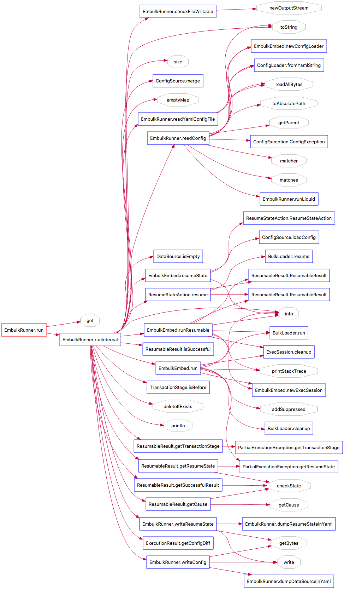
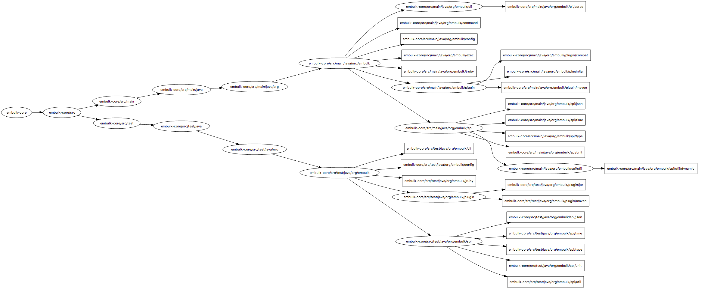

## 序言

**先上干货：**

> embulk的流程图


*从上图可以看出，embulk支持对很多不同存储类型的数据源的数据进行转移，而转移的实现在embulk中是采用了插件的机制，通过`embulk gem install ***`命令来安装插件。*


> butterfly图



> Architecture图



**embulk的github地址：**https://github.com/embulk/embulk

**embulk的安装（仅列出linux下的安装方式，windows安装请看github上的文档）：**

```shell
curl --create-dirs -o ~/.embulk/bin/embulk -L "https://dl.embulk.org/embulk-latest.jar"
chmod +x ~/.embulk/bin/embulk
echo 'export PATH="$HOME/.embulk/bin:$PATH"' >> ~/.bashrc
source ~/.bashrc
```


**embulk的相关概念：**

- embulk的插件采用ruby gem方式安装，他的插件放在了ruby库中，通过`embulk gem list`命令可以查看本地已经安装的embulk插件
- 

